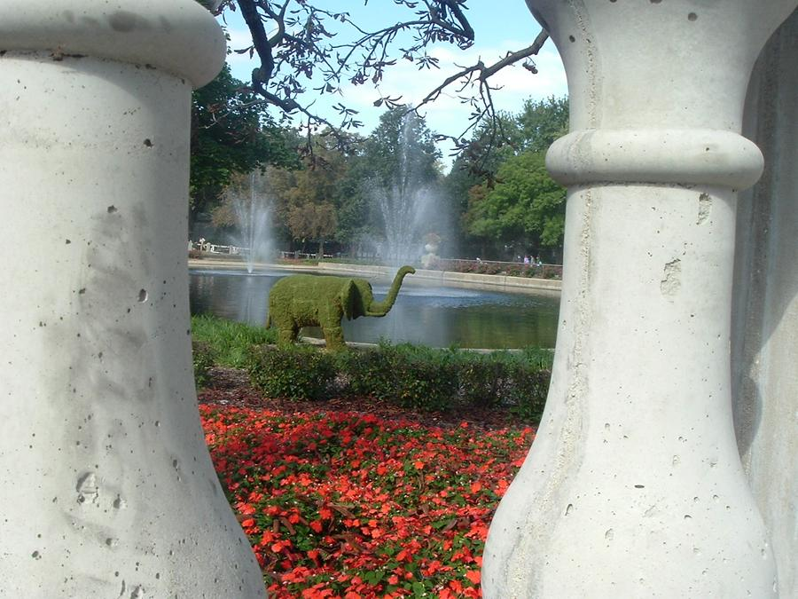
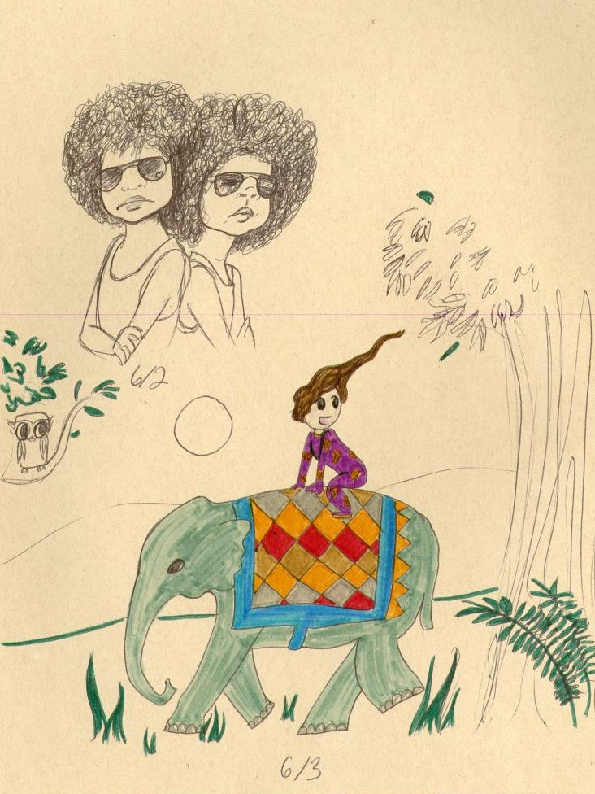

# Finding Inspiration

## The beginings of the Elusive Green Elephant

<small>Posted on April 4, 2021</small>

Happy Easter if you celebrate it and happy Sunday if you don't!

In 2013 I started making paper art and it was great. Using shape and color to illustrate a scene. It was very different from my other art. Around the same time I was taking an experimental animation class and decided to have fun. By the end of class I made this 20 second clip.

<iframe width=560 height=315 style=" margin-left:5em" src="https://www.youtube.com/embed/U2bHWUvy220" title="YouTube video player" frameborder="0" allow="accelerometer; autoplay; clipboard-write; encrypted-media; gyroscope; picture-in-picture" allowfullscreen></iframe>

This is when I knew I had to make a short about these characters. However, my interest in the Elusive Green Elephant is even older than this. In Highschool I wrote a story about a young boy, his grandfather, and a green elephant. The idea hit me after taking the photo below.
{: style="margin-left:3em; width:40vw; height:auto"}

Elephant shaped hedge in front of a water fountain.
I also took a visual storytelling class in 2013. At the end of the class we needed to complete an animatic. Mine was a variation of my original Elusive Green Elephant story. It is a fun variation, but not what I want for this iteration.
{: style=" margin-left:3em; width:40vw; height:auto"}

Drawing from a sketch book. Upper left corner is 2 boys back to back looking towards audience, they are wearing sunglasses. Bottom of the page has a boy in pjs on a green elephant
This new short needs to be magical, whimsical and full of black boy joy. To me that means it is lead by the visuals. In this version, the boy will travel the world with mythical elephants. Around March or April of 2020 I reached out to my friend and former college roommate, Jinnace Gray. I love her designs and thought maybe she could help visually. She gave me a few sketches and I loved them. The elephants would be representative of where they're from (China, India, and Africa) but will be mythical, not to much like real elephants. The green elephant will be covered in leaves (like the hedge!). It inspired me to make the first round storyboards (maybe I'll show them later).

But Alas, I'm not a storyboard artist. So I reached out to another college friend that studied storyboarding and story development, Colleen (McMarlow) McMahon. She is helping me stick to the basics and organize my thoughts, be concise, and find useful productivity apps. Remember to reach out to those in your network! I would still have the same vague idea in my head from 7 years ago if I hadn't reached out to both Jinnace and Colleen.

Next month will be Finding Story.
